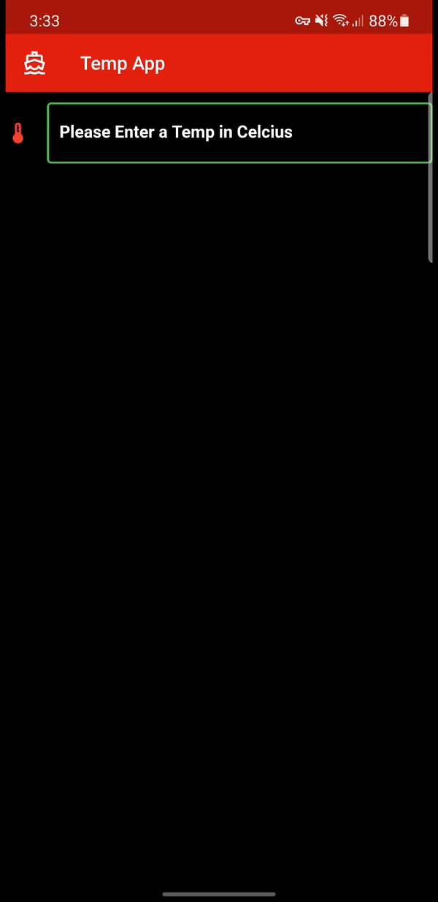

# temp_app

A beginner level Flutter Temperature Converter application highlighting keyboard types, working with forms with data sanitization.

## Demo

For help getting started with Flutter, view our
[online documentation](https://flutter.dev/docs), which offers tutorials,
samples, guidance on mobile development, and a full API reference.
